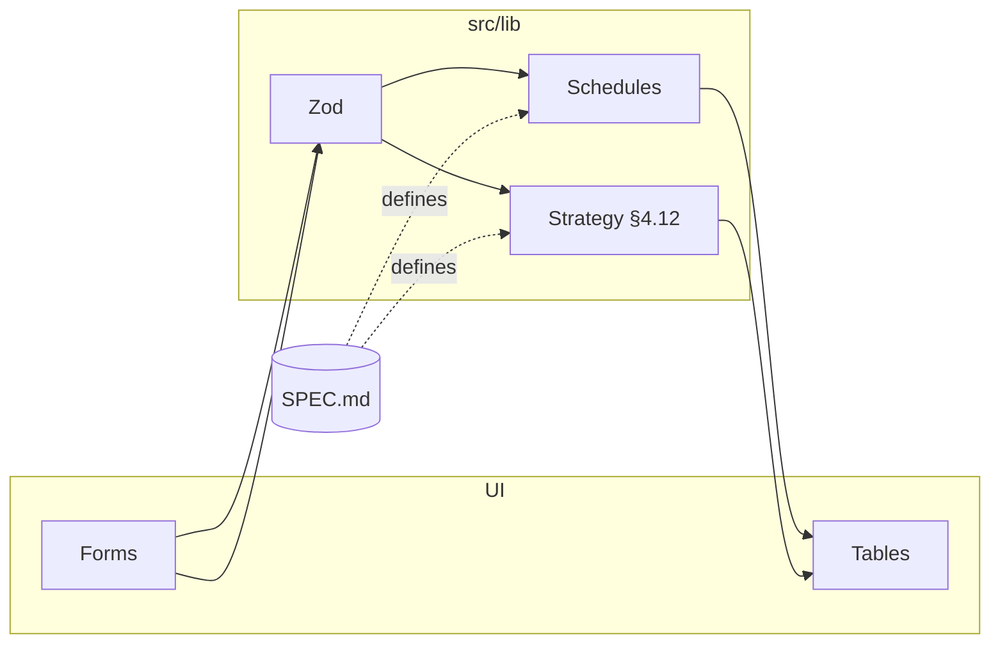

# FinancialPlanner — overview

High-level orientation. **Authoritative product rules:** [`SPEC.md`](SPEC.md). **Agent workflow:** [`../AGENTS.md`](../AGENTS.md).

## Problem

Help Indian borrowers **compare loan payoff strategies** (prepayments, tenure vs EMI, optional unemployment + PF withdrawal paths) with transparent amortisation numbers, and **compare three named repayment strategies** (equity blend, prepay heavy, aggressive prepay) per **SPEC §4.12**.

## Users & personas

See **SPEC §3** (borrower optimiser, stress tester, comparator).

## Architecture

| Area | Role |
|------|------|
| `src/lib/` | Pure finance modules: loan amortisation, debt payoff strategy engine, retirement corpus projection, **repayment strategy planner** (`strategy/`), input shaping, formatting. |
| `src/features/strategy/` | §4.12 household inputs, tier presets, strategy comparison + allocation tables. |
| `src/App.tsx` (and other `features/`) | Dashboard inputs, scenario selection, comparison tables, timeline views. |
| `docs/SPEC.md` | Source of truth for behaviour and acceptance tests. |

**Data flow:** form values → input parse/validation → simulation functions → summary + timeline rows → UI.



## Tech stack

Vite, React 19, TypeScript, Zod, Vitest, jsdom (see `package.json`).

## Testing & quality

- **§10** in SPEC lists acceptance-style checks.  
- Unit tests under `src/lib/*.test.ts`.  
- Golden / fixture JSON under `src/test/fixtures/goldens/` (loan snapshots) and `src/test/fixtures/strategy/` (§15.1 tier × strategy); regenerate with `npm run goldens:update`.

```bash
npm run test
npm run build
npm run dev
```

## Related docs

| Doc | Purpose |
|-----|---------|
| [SPEC.md](SPEC.md) | Full product & engineering specification |
| [TASKS.md](TASKS.md) | Feature delivery checklist (`[ ]` → `[x]`) |
| [LEARNINGS.md](LEARNINGS.md) | Dated post-feature notes |
| [research/README.md](research/README.md) | Spike and research index |
| [../AGENTS.md](../AGENTS.md) | Cursor agent + skill index |

## Research

_Add links to `docs/research/*.md` files as they are created._
