# SEO improvement — task checklist

Tasks derived from the **SEO Improvement Spec** (uploaded 2026-07-19). Cross-referenced against current implementation (`src/lib/seo.ts`, `index.html`, `vite.config.ts`, `docs/SPEC.md` §8, `docs/research/2026-07-financial-sites-seo.md`).

**How to use:** mark done with `- [x]`. Work phases **in order** — later phases depend on earlier ones. Ship via `sdd-create-feature`; update `docs/SPEC.md` §8 before behaviour changes.

---

## Feature block

| Field | Value |
|-------|-------|
| **Feature name** | SEO gap-fill (routes, noscript, content, CWV audit) |
| **SPEC sections** | §8 (extend), new §10 acceptance bullets |
| **Branch / PR** | *(not started)* |
| **Started** | 2026-07-19 |

---

## Phase overview

| Phase | Name | Spec ref | Depends on | Status |
|------:|------|----------|------------|--------|
| 0 | Intake & research | — | — | Not started |
| 1 | Requirements (SPEC) | — | 0 | Not started |
| 2 | Per-calculator routes & URLs | 1.2 | 1 | **Partial** — meta done, paths not |
| 3 | Structured data (JSON-LD) | 1.1 | 2 | **Mostly done** |
| 4 | Sitemap & robots.txt | 2.1 | 2 | **Mostly done** |
| 5 | Noscript & crawler fallback | 1.3 | 2 | Not started |
| 6 | Heading hierarchy | 2.2 | 2 | Not started |
| 7 | Alt text & ARIA | 2.3 | — | **Partial** |
| 8 | Internal linking | 2.4 | 2, 6 | Not started |
| 9 | Explainer content | 3.1 | 6 | Not started |
| 10 | Page speed & Core Web Vitals | 2.5 | — | **Partial** — sampling only |
| 11 | Automated verification | §10 | 2–10 | **Partial** |
| 12 | Feature sign-off | — | 11 | Not started |
| 13 | Ship & authority (manual) | 3.2 | 12 | Not started |

```mermaid
flowchart LR
  P0[0 Research] --> P1[1 SPEC]
  P1 --> P2[2 Routes]
  P2 --> P3[3 JSON-LD]
  P2 --> P4[4 Sitemap]
  P2 --> P5[5 Noscript]
  P2 --> P6[6 Headings]
  P6 --> P8[8 Links]
  P6 --> P9[9 Content]
  P7[7 A11y] --> P11[11 Tests]
  P8 --> P11
  P9 --> P11
  P10[10 CWV] --> P11
  P3 --> P11
  P4 --> P11
  P5 --> P11
  P11 --> P12[12 Sign-off]
  P12 --> P13[13 Ship]
```

---

## Phase 0 — Intake & research

**Goal:** Lock routing and pre-render decisions before coding.

- [ ] **0.1** Confirm **user outcome**: each calculator is discoverable individually in search with rich results and crawlable fallback content.
- [ ] **0.2** Decide **routing strategy**: path routes (`/`, `/debt`, `/retirement`, `/strategies`, `/strategic`, `/budget`) vs keep `/?tab=` (spec allows hash routes; query params already in sitemap). Document trade-off for GitHub Pages SPA (`404.html` fallback).
- [ ] **0.3** Spike if needed: **static pre-render per tab** (`vite-plugin-ssr`, `vite-ssg`, or build-time HTML shells) — research doc Option B; only if noscript is insufficient.
- [ ] **0.4** Extend [`docs/research/2026-07-financial-sites-seo.md`](research/2026-07-financial-sites-seo.md) with path-route + noscript decision.

---

## Phase 1 — Requirements (`docs/SPEC.md`)

**Goal:** Encode new SEO behaviours in the spec before implementation.

- [ ] **1.1** Extend §8 **SEO metadata** with:
  - Path-based tab URLs (or explicit acceptance of query-param canonicals).
  - `<noscript>` fallback block requirements (plain-text per calculator).
  - Per-tab `<h1>` rule (calculator name, not site brand).
  - Internal linking requirement (≥1 contextual link per tab).
  - Explainer content requirement (100–200 unique words per tab).
- [ ] **1.2** Add §10 acceptance tests for new SEO behaviours (noscript present, h1 per tab, internal links, explainer word count).
- [ ] **1.3** Confirm §11 non-goals unchanged (no paid link building, no hreflang, no meta A/B).

---

## Phase 2 — Per-calculator routes & URLs

**Goal:** Each calculator has its own crawlable URL. **Foundational — unlocks phases 3–6, 8–9.**

| Done | Task |
|:----:|------|
| [x] | **2.1** Unique `<title>` and `<meta name="description">` per tab — `pageTitle()`, `pageDescription()`, `updatePageSeo()`. |
| [x] | **2.2** Canonical + OG/Twitter tags update on tab change. |
| [ ] | **2.3** Introduce **path routes** (e.g. `/`, `/debt`, `/retirement`, `/strategies`, `/strategic`, `/budget`) with client-side router (or Vite MPA shells). |
| [ ] | **2.4** GitHub Pages SPA fallback: `404.html` → `index.html` rewrite preserves path; update `tabPageUrl()` + sitemap URLs. |
| [ ] | **2.5** Redirect or canonicalise legacy `/?tab=` URLs to new paths (301 via meta refresh or router `replaceState`). |
| [ ] | **2.6** E2E: direct navigation to each path loads correct tab + correct `document.title`. |

---

## Phase 3 — Structured data (JSON-LD)

**Goal:** Rich results eligibility via valid schema markup. Spec ref: **1.1**.

| Done | Task |
|:----:|------|
| [x] | **3.1** `WebApplication` JSON-LD: `name`, `applicationCategory: FinanceApplication`, `offers` price 0, `description`, `featureList`, `publisher.sameAs`. |
| [x] | **3.2** `BreadcrumbList` on non-home tabs. |
| [x] | **3.3** Injected in `<head>` at build (loan tab) and updated on tab change. |
| [ ] | **3.4** Re-verify JSON-LD URLs after path-route migration (Phase 2). |
| [ ] | **3.5** Manual smoke: pass [Google Rich Results Test](https://search.google.com/test/rich-results) for home + one sub-tab on deployed build. |

---

## Phase 4 — Sitemap & robots.txt

**Goal:** Crawlers can discover every calculator page. Spec ref: **2.1**.

| Done | Task |
|:----:|------|
| [x] | **4.1** `robots.txt` generated at build — `Allow: /`, sitemap pointer. |
| [x] | **4.2** `sitemap.xml` lists every tab URL with `<lastmod>` from git commit date. |
| [ ] | **4.3** Update sitemap entries to path URLs after Phase 2. |
| [ ] | **4.4** Submit updated sitemap in Google Search Console *(manual, post-deploy)*. |

---

## Phase 5 — Noscript & crawler fallback

**Goal:** Plain-text content visible to non-JS crawlers. Spec ref: **1.3**.

- [ ] **5.1** Add `<noscript>` block in `index.html` (or per-route HTML shells) with plain-text description of each calculator's purpose.
- [ ] **5.2** Noscript copy unique per tab if using path shells; otherwise aggregate all calculators on home noscript block.
- [ ] **5.3** *(Optional spike)* Evaluate build-time static HTML pre-render for landing + tab shells; document go/no-go in research note. *(Deferred unless 5.1–5.2 insufficient.)*

---

## Phase 6 — Heading hierarchy

**Goal:** One calculator-specific `<h1>` per page; no skipped levels. Spec ref: **2.2**.

- [ ] **6.1** One `<h1>` per tab view — e.g. "Loan EMI Calculator", "Debt Avalanche vs Snowball Calculator" (use `PLANNER_TABS[].seoTitle` or dedicated `h1` field).
- [ ] **6.2** Demote current site-wide `<h1>FinancialPlanner</h1>` in `App.tsx` to `
` or branded `` (logo text).
- [ ] **6.3** Audit section headings: no skipped levels (`h1` → `h2` → `h3`); fix any `h3` under missing `h2`.
- [ ] **6.4** Unit or a11y test: exactly one `h1` per tab panel.

---

## Phase 7 — Alt text & ARIA

**Goal:** Accessible labels on all interactive and informational elements. Spec ref: **2.3**. *(Can run in parallel with Phase 6.)*

| Done | Task |
|:----:|------|
| [x] | **7.1** Charts: `aria-label` on `LineChart`, `BarChart`, `PayoffHeatmap`. |
| [x] | **7.2** Many form inputs: per-field `aria-label` in debt/budget/loan sections. |
| [ ] | **7.3** Run `scripts/a11y-audit.ts` across **all six tabs** (budget tab missing from audit list today). |
| [ ] | **7.4** Fix any axe violations for missing labels / colour contrast. |
| [ ] | **7.5** Non-decorative images: confirm `og-image.png` alt via meta; add `alt` on any inline `` if introduced. |

---

## Phase 8 — Internal linking

**Goal:** Contextual cross-links between calculators for crawl equity and session depth. Spec ref: **2.4**. *(Requires Phase 2 path URLs.)*

- [ ] **8.1** Add contextual "Related calculators" block per tab (e.g. loan → retirement, debt → budget).
- [ ] **8.2** Use real `<a href>` path URLs for crawlability; tab switch via router on same-origin navigation.
- [ ] **8.3** At least one contextual internal link per calculator page (acceptance).

---

## Phase 9 — Explainer content

**Goal:** 100–200 words of unique, indexable copy per calculator. Spec ref: **3.1**. *(Requires Phase 6 h1 structure.)*

- [ ] **9.1** Add 100–200 words unique explanatory copy per tab: formula summary + example walkthrough.
- [ ] **9.2** Place below KPI strip or above inputs (aligns with noscript fallback in Phase 5).
- [ ] **9.3** Locale-aware variants optional (IN/US/UK) — start with `en` generic if scope is tight.
- [ ] **9.4** Test: word count per tab within 100–200 range.

---

## Phase 10 — Page speed & Core Web Vitals

**Goal:** LCP &lt; 2.5s, CLS &lt; 0.1 on mobile. Spec ref: **2.5**. *(Can run in parallel with Phases 6–9.)*

| Done | Task |
|:----:|------|
| [x] | **10.1** Runtime `web-vitals` sampling to GA4 (§5.1.2). |
| [ ] | **10.2** Run Lighthouse mobile audit on production URL; record LCP, CLS, INP baseline. |
| [ ] | **10.3** If LCP ≥ 2.5s or CLS ≥ 0.1: font subsetting, lazy-load heavy tabs, or code-split `GameSection` / charts. |
| [ ] | **10.4** *(Stretch)* CI script: fail build if Lighthouse scores regress. |

---

## Phase 11 — Automated verification

**Goal:** Bind implementation to §10 acceptance criteria.

| Done | Task |
|:----:|------|
| [x] | **11.1** `src/lib/seo.test.ts` — titles, descriptions, JSON-LD, sitemap, robots (§10.45–47). |
| [ ] | **11.2** Tests for path URLs in `tabPageUrl()` after Phase 2. |
| [ ] | **11.3** Tests for per-tab `h1` text (component or DOM snapshot). |
| [ ] | **11.4** Tests for internal link presence per tab. |
| [ ] | **11.5** Tests for explainer word-count bounds. |
| [ ] | **11.6** `npm run lint` + `npm run test` + `npm run build` clean. |

---

## Phase 12 — Feature sign-off

**Goal:** Manual acceptance before merge.

- [ ] **12.1** Map new §10 bullets in `docs/TEST-MAP.md`.
- [ ] **12.2** Manual smoke: each path loads correct tab, title, h1, JSON-LD, noscript visible with JS disabled.
- [ ] **12.3** Rich Results Test on deployed build.
- [ ] **12.4** `sdd-verify-feature` checklist complete.

---

## Phase 13 — Ship & authority (manual)

**Goal:** Post-deploy distribution and trust signals. Spec ref: **3.2**. *(Outside repo for LinkedIn.)*

- [ ] **13.1** Confirm live demo link prominent in `README.md` *(likely already present)*.
- [ ] **13.2** Add site link to GitHub profile / repo About URL.
- [ ] **13.3** Add Featured link on LinkedIn *(manual, outside repo)*.
- [ ] **13.4** `CHANGELOG.md` + PR citing SPEC §8 extension.

---

## Out of scope (this pass)

- Paid link building / guest posts (spec §5).
- Multi-language `hreflang` (spec §5).
- Meta description A/B testing (spec §5).
- FAQPage JSON-LD without visible Q&A (Google deprecated May 2026; see research doc).
