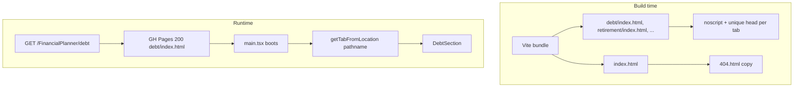

# Research: SEO path routes, noscript fallback, and pre-render

**Date:** 2026-07-19 · **Status:** concluded · **Feeds:** `docs/TASKS-SEO.md` Phase 0–1, `docs/SPEC.md` §8 (v2.6), §10.52–58

**Parent note:** extends [`2026-07-financial-sites-seo.md`](2026-07-financial-sites-seo.md) (Option A shipped; this spike covers remaining gaps from the uploaded SEO Improvement Spec).

---

## 1. Question

How should FinancialPlanner expose **per-calculator URLs** and **crawler-visible fallback content** on a Vite + React SPA deployed to **GitHub Pages** (`VITE_BASE=/FinancialPlanner/`) and optionally **CloudFront** — without a Next.js migration?

Sub-questions:

1. Path routes vs query-param tabs (`/?tab=debt`)?
2. How to avoid GitHub Pages returning HTTP 404 on deep links?
3. Is build-time static pre-render required, or is `<noscript>` enough?

---

## 2. Constraints

- **Stack:** Vite + React SPA (§12); no backend.
- **Deploy targets:** GitHub Pages (primary demo) and AWS CloudFront (SPA 403/404 → `index.html` with HTTP 200 — see `infra/terraform/cloudfront.tf`).
- **Privacy:** §5.1 — no user data in URLs; no third-party SEO scripts (§11).
- **Existing SEO:** per-tab titles, meta, JSON-LD, sitemap, robots already shipped (`src/lib/seo.ts`, SPEC §8).
- **Mobile:** Capacitor build uses `VITE_BASE=./`; path routing must not break relative asset loading.

---

## 3. User outcome (Phase 0.1)

> Each calculator is **individually discoverable** in search: unique URL, unique title/description, valid structured data, and **plain-text fallback** visible without JavaScript — so Google and secondary crawlers (Bing, social preview bots) can index calculator intent even before JS executes.

Success metrics (post-ship, manual):

- Google Search Console shows separate URLs indexed (not only `/`).
- Rich Results Test passes `WebApplication` on home + one sub-calculator URL.
- Fetching a calculator URL without JS returns meaningful text (noscript block).

---

## 4. Current state

| Item | Today |
|------|--------|
| Tab identity | `TabId`: `loan`, `debt`, `retirement`, `strategies`, `strategic`, `budget` |
| URL scheme | `/?tab={id}` (loan = `/` with no param) |
| Router | Custom `getTabFromLocation` reads **query string only**; `setTabInUrl` writes query param |
| Sitemap | Lists `/?tab=debt` etc. via `tabPageUrl()` |
| `index.html` body | Empty `
` — no noscript |
| GH Pages SPA | **No `404.html`** in build output |
| CloudFront | SPA fallback returns **200** for unknown paths |
| Dependencies | No `react-router`; History API only |

---

## 5. Options

### 5.1 URL scheme

| Option | Example URLs | Pros | Cons |
|--------|--------------|------|------|
| **A. Keep query params** | `/?tab=debt` | Zero routing work; sitemap already lists them | Weak keyword signal in URL; uploaded spec explicitly wants path routes |
| **B. Path slugs** | `/debt`, `/retirement`, … | Clean canonicals; matches competitor pattern; better for internal `<a href>` | Requires router + deploy shell files |
| **C. Hash routes** | `/#/debt` | Trivial GH Pages compat | Poor SEO; Google treats hash fragments inconsistently |

**Pick: B — path slugs.**

Proposed slug map (tab id → path segment):

| `TabId` | Path | Notes |
|---------|------|-------|
| `loan` | `/` | Home; keyword “EMI” stays in `<title>` / future `<h1>` |
| `debt` | `/debt` | Shorter than `/debt-payoff`; matches nav label |
| `retirement` | `/retirement` | Aligns with uploaded spec |
| `strategies` | `/strategies` | |
| `strategic` | `/strategic` | |
| `budget` | `/budget` | |

Optional **aliases** (Phase 2 stretch, not blocking): `/emi` → `/`, `/debt-payoff` → `/debt` via client `replaceState` redirect.

Legacy `/?tab={id}` → **301-equivalent** client redirect to `/{slug}` on load (preserve UTM params).

### 5.2 GitHub Pages deep-link serving

| Option | Mechanism | HTTP status on `/FinancialPlanner/debt` | SEO risk |
|--------|-----------|----------------------------------------|----------|
| **A. `404.html` copy only** | `cp index.html 404.html` | **404** (GH Pages serves 404.html with 404 status) | Soft-404 risk in GSC |
| **B. spa-github-pages redirect** | 404.html redirects to `/?/debt`; script rewrites URL | **404** on first hop | Same; helps client routing only |
| **C. Per-route `index.html` directories** | Build emits `debt/index.html`, `retirement/index.html`, … | **200** | Best for GH Pages; minimal extra build logic |
| **D. CloudFront only** | Path routes on custom domain | **200** | Leaves GH Pages demo broken for deep links |

**Pick: C — per-route HTML shells at build time**, plus `404.html` copy as safety net.

Implementation sketch (Phase 2):

1. Extend `vite.config.ts` `closeBundle` to write `{slug}/index.html` for each non-home tab using `buildIndexHtmlReplacements(siteUrl, { tabId })`.
2. Home stays `dist/index.html`.
3. Copy `index.html` → `404.html` for unmatched paths.
4. App boot: `getTabFromLocation` parses `pathname` relative to `import.meta.env.BASE_URL`, with query-param fallback.

CloudFront needs **no terraform change** — existing SPA fallback still works; physical files take precedence when present.

### 5.3 Crawler fallback (noscript / pre-render)

| Option | What crawlers see | Build cost | Recommendation |
|--------|-------------------|------------|----------------|
| **A. `<noscript>` in single `index.html`** | All calculators listed on every URL | Low | OK for home; sub-URLs still 404 without shells |
| **B. Per-route shells + `<noscript>`** | Calculator-specific plain text per URL | Low (reuse SEO token injection) | **Pick** — pairs with 5.2-C |
| **C. Full prerender (vite-ssg / SSR)** | Full rendered React HTML in first byte | High; new router integration | Defer |
| **D. Next.js migration** | SSR/SSG native | Very high | Reject (§12, prior research) |

**Pick: B — per-route `<noscript>` blocks** in build-time HTML shells.

Each shell includes:

- Unique `<title>`, `<meta name="description">`, canonical, OG tags, JSON-LD (already supported by `buildIndexHtmlReplacements`).
- `<noscript>` with 2–3 sentences describing **that** calculator (source: `PLANNER_TABS[].description` + link list to sibling calculators).

Full React body prerender (**Option C**) deferred until GSC shows indexing gaps after Phases 2–5 ship.

---

## 6. Sources

- Uploaded **SEO Improvement Spec** (2026-07-19): path routes, noscript, build order.
- [`2026-07-financial-sites-seo.md`](2026-07-financial-sites-seo.md): Option A done; Option B prerender deferred.
- GitHub Pages SPA routing: [rafgraph/spa-github-pages](https://github.com/rafgraph/spa-github-pages) (404-status limitation documented).
- Google: JS rendering supported but slower; plain HTML in first response preferred for crawlers.
- Existing codebase: `src/lib/seo.ts`, `vite.config.ts` `seoPlugin`, `infra/terraform/cloudfront.tf` SPA fallback.

---

## 7. Recommendation (Phase 0 decisions)

| Decision | Choice |
|----------|--------|
| **0.2 Routing** | Path slugs (`/debt`, `/retirement`, …); `/` = loan; legacy `/?tab=` redirects |
| **0.3 Pre-render** | **Defer** full prerender; use **build-time HTML shells** + `<noscript>` per route |
| **GH Pages** | Emit `dist/{slug}/index.html` + `404.html` copy in `closeBundle` |
| **Router** | Extend `getTabFromLocation` / `setTabInUrl` / `tabPageUrl` — no new dependency |
| **Mobile** | Path routing is web-only; Capacitor loads `index.html` at `./` (unchanged) |

---

## 8. Spec delta (for Phase 1 — `sdd-spec-change-first`)

Paste into **`docs/SPEC.md` §8 SEO metadata** when Phase 1 starts:

- **URLs:** each planner tab has a canonical **path slug** (`/`, `/debt`, `/retirement`, `/strategies`, `/strategic`, `/budget`) under `VITE_BASE`. `tabPageUrl()` returns the full absolute URL. Legacy `/?tab={id}` URLs redirect to the path slug (query params except `tab` preserved).
- **Build output:** production build emits a physical `index.html` per slug directory plus `404.html` (copy of home shell).
- **Noscript:** each HTML shell includes a `<noscript>` block with plain-text calculator description (≥ 2 sentences) and links to other calculator paths.
- **§10 acceptance:** add tests for pathname parsing, `tabPageUrl` paths, per-shell noscript presence, legacy redirect.

---

## 9. Implementation touchpoints (Phase 2 preview)

| File | Change |
|------|--------|
| `src/lib/seo.ts` | `TAB_PATHS` map; `getTabFromPathname()`; update `tabPageUrl`, `setTabInUrl`, `getTabFromLocation` |
| `vite.config.ts` | `closeBundle`: write per-slug `index.html`, `404.html` |
| `index.html` | Add `<noscript>` placeholder token `__SEO_NOSCRIPT__` |
| `src/App.tsx` | Legacy `?tab=` redirect on mount |
| `src/lib/seo.test.ts` | Path URL tests |
| `e2e/helpers/page.ts` | `gotoApp` uses path URLs |
| `.github/workflows/pages.yml` | No change expected (build handles artifacts) |

**Out of scope:** `react-router` dependency, Next.js, hreflang, paid backlinks.
